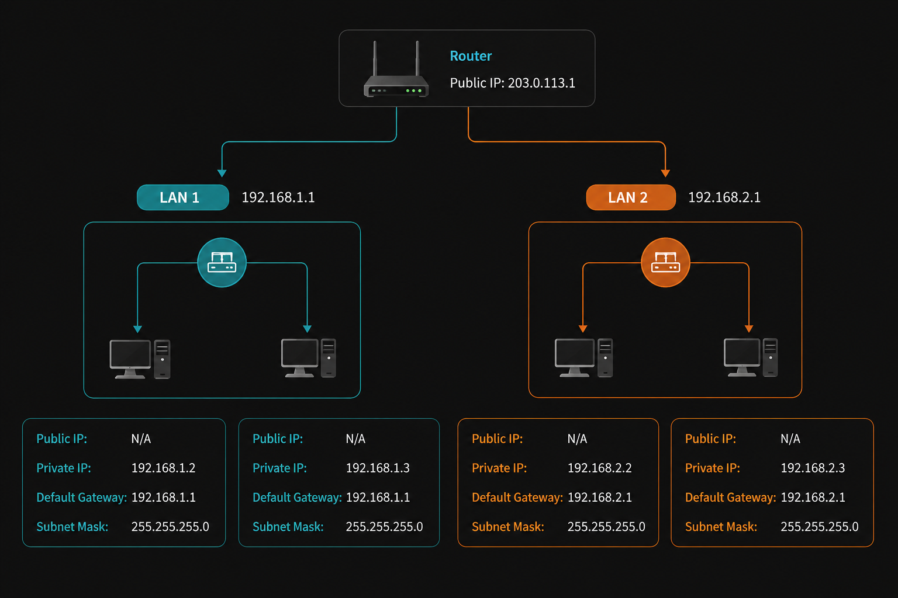

# Network Topology and IP Addressing

## Project Overview
This project demonstrates the implementation and documentation of networking fundamentals concepts, including IP addressing, subnet masks, default gateways, and communication across multiple LAN segments connected through a router.

## Concepts Covered
- Public and Private IP Addressing
- Default Gateway Configuration
- Subnet Masking
- LAN Segmentation
- Router-Based Network Communication

## Network Details

| Device | IP Address | Gateway | Subnet Mask |
|---------|------------|----------|--------------|
| PC 1 | 192.168.1.2 | 192.168.1.1 | 255.255.255.0 |
| PC 2 | 192.168.1.3 | 192.168.1.1 | 255.255.255.0 |
| PC 3 | 192.168.2.2 | 192.168.2.1 | 255.255.255.0 |
| PC 4 | 192.168.2.3 | 192.168.2.1 | 255.255.255.0 |

## Project Preview

